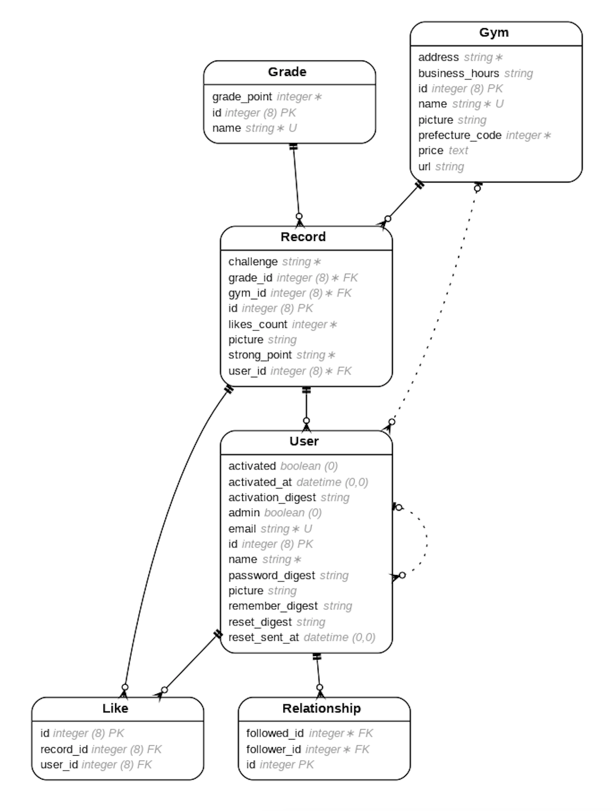

# Nobolt

## URL
https://nobolt-app.com/  
お試しログインができます。 

## 概要
- 記録  
全国のジムで記録を残すことができます。
- ランキング  
全国共通のランキングシステムで仲間と自分の位置を確認できます。
- フォロー  
気になる仲間をフォローできます。

## なぜこのサービスを作ったのか
趣味で3年ほどボルダリングをしています。そんな中、周りの強い人はどのくらい登ってここまで強くなったんだろう。自分とあの強い人の差はどのくらいなんだろう。という疑問が浮かびました。この疑問に答えるべく、ボルダリングの記録ができ、他のクライマーの記録と比較できるアプリを作成しました。

## 使用技術一覧
### インフラ
- AWS (VPC, EC2, RDS, ALB, Route53, ACM, IAM, S3)
- Docker, Docker-compose (開発環境)
- CircleCI
- puma
- nginx
- Capistrano

### バックエンド
- Ruby 2.4.9
- Rails 5.2.4
- MySQL 5.7

### フロントエンド
- Slim
- Scss
- javaScript
- jQuery
- Ajax
- factory_bot
- レスポンシブデザイン
- Bootstrap

### テスト、静的コード解析
- Rspec
- Rubocop

### 機能一覧
- ユーザログイン・登録機能
- 完登記録登録機能
- Google Places APIを用いた新規ジム検索機能
- ジム編集・削除機能
- 完登記録一覧表示機能（自分・フォローユーザ・全ユーザ）
- 画像投稿機能
- 完登記録に対するいいね機能（Ajaxによる非同期処理）
- ランキング機能
- グラフ機能
- プロフィール編集機能
- ユーザ一覧機能
- pagination

## インフラ構成図

## ER図

## 工夫したところ
- スマホ操作しやすいレスポンシブデザイン。
  - ボルダリング中に記録しやすいよう、スマホに優しい設計。
- 完登記録のマイページで、登った記録を級・ジムごとに絞り込める。
  - 自分の記録を級・ジムごとに確認したいニーズに対応。
- 全国のジムで共通の採点システムを採用。
  - 違うジムのクライマーとも自分の立ち位置を比較できる仕組みを構築。
- Google Places APIを使った新規ジム検索。
  - 全国のジムで記録できるように、ジムの名称が一意で、新しいジムが自動で登録される外部サービスの利用。

## 今後、改善したい点
- 記録する課題の指定方法が、ユーザー依存になっているのを解消する。
- ボルダリングはジムごとに、同じ級でも難易度が違う傾向にある。この傾向を考慮して、スコアを補正できるようにする。
- 相互フォローのユーザーがDMを送れる機能を追加する。